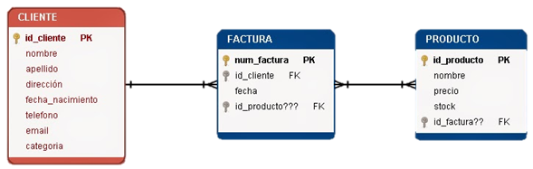

# Prueba desarrollo - Miguel Silva

El proyecto consiste en una aplicación web que permite visualizar los datos de una API y realizar operaciones CRUD sobre los mismos de un sistema improvisado de facturación.

## Tecnologías Utilizadas
- Node.js
- Express
- MongoDB
- Vue.js
- Vue Router
- DataTables
- Bootstrap
- JQuery

## Modelo de Datos
El modelo de datos de la aplicación es el siguiente:



Se encuentra una ligera modificación en el modelo de datos, ya que se agregó una nueva tabla facturaProducto, puesto la tabla factura y producto tienen una relación NN y se necesita una tabla intermedia para poder relacionarlas.  La tabla facturaProducto tiene los campos _id, idFactura, idProducto.

## Migracion db
No es necesario tener instalado MongoDB, ya que la aplicación se conecta a una base de datos en la nube. Sin embargo, he creado un folio con los datos de la base de datos para que puedas importarlos en tu MongoDB local. Para ello, sigue los siguientes pasos:

1. Abre una terminal y navega al directorio del servidor.
```bash
  cd db
```

2. !SOLO SI NO HAY DATOS EN LA DB!. Importa los datos de la base de datos. (En cada carpeta está el formato json de cada colección).

3. (Solo en caso de que no hayan registros en la db). Importa cada coleccion, los modelos están en el backend en la carpeta models para guiarse de los campos.

4. Sigue los pasos para configurar el servidor y el cliente.

## Requisitos Previos
- Node.js y npm instalados.
- Git (opcional, si clonas el repositorio).

## Configuración del Servidor
1. Abre una terminal y navega al directorio del servidor.
```bash
  cd backend
```

2. Instala las dependencias del servidor.
```bash
  npm install
```
3. Inicia el servidor.
```bash
  npm start
```

El servidor estará disponible en http://localhost:3000

## Configuración del Cliente
1. Abre una terminal y navega al directorio del cliente.
```bash
  cd front
```
2. Instala las dependencias del cliente.
```bash
  npm install
```
3. Inicia el cliente.
```bash
  npm run dev
```
La aplicación estará disponible en http://localhost:5173/


## Desarrollador

- [@MIGUELNINOSILVA](https://github.com/MIGUELNINOSILVA/)

#### Nota
- El proyecto se realizó en 2 días, por lo que no se pudo realizar todas las funcionalidades que se querían, sin embargo, se logró realizar la mayoría de las funcionalidades. Teniendo en cuenta que mi stack es MERN, no he tenido la oportunidad de trabajar con Vue.js, por lo que tuve que aprenderlo en el proceso de desarrollo. Agradezco por el reto, ya que me permitió aprender una nueva tecnología y poner a prueba mis conocimientos.

- El proyecto está publicado en un repositorio publico de GitHub, por lo que se puede clonar y ejecutar en local. Sin embargo, no se puede realizar el deploy en un servidor, ya que no se cuenta con los recursos para ello.

##### Link de repositorio
- [Proyecto de prueba FULL STACK](https://github.com/MIGUELNINOSILVA/prueba-desarrollo-Miguel-Silva.git)